# Projectlens

Local lint, type-check & AI security dashboard for JS/TS projects. Run one command inside any project and Projectlens runs your **real** ESLint and TypeScript toolchain, audits your dependencies, runs an AI security review over your source, and opens a live dashboard at `localhost:4321`.

| | |
|---|---|
| 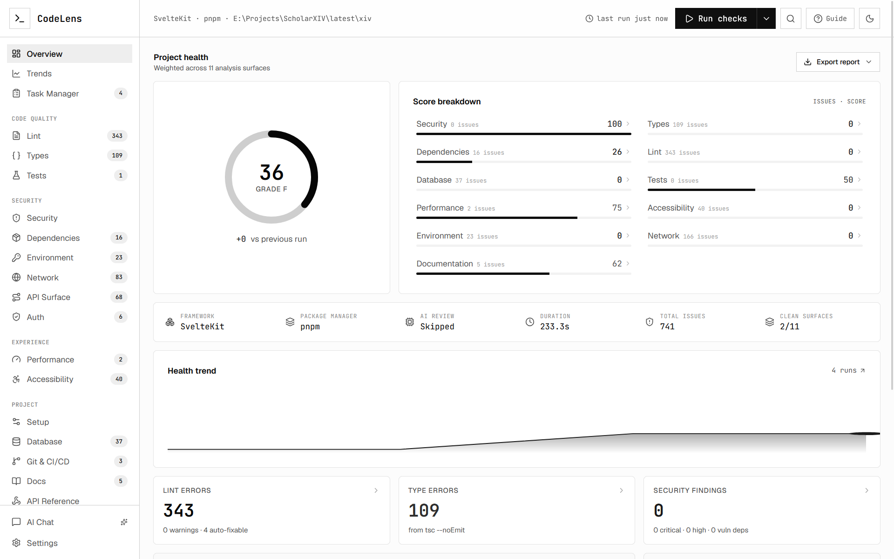 | 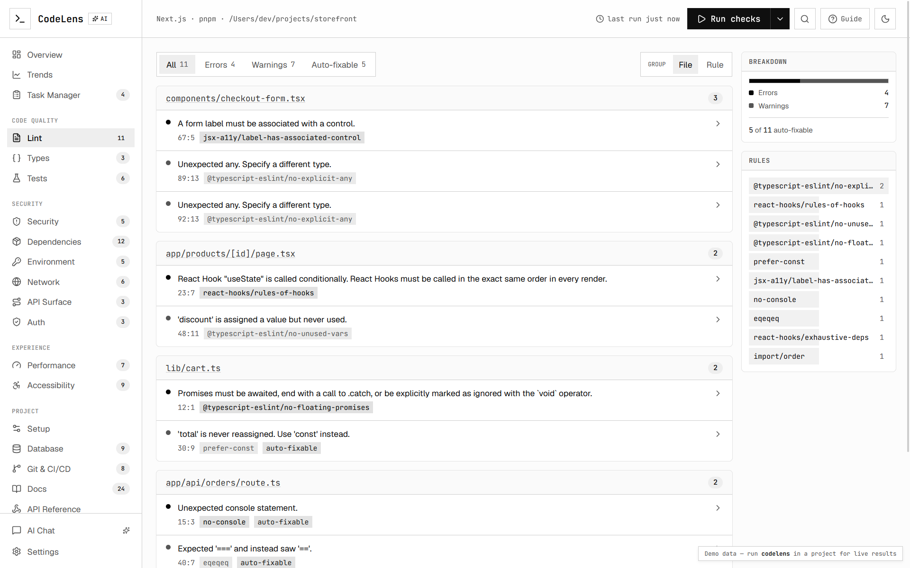 |

## Quick Start

```bash
npm install -g projectlens
cd your-project
projectlens
```

## Features

- **ESLint integration** — runs your real ESLint config, surfaces findings by severity with file and line info
- **TypeScript checking** — spawns `tsc`, parses diagnostics with fix hints and error chains
- **AI security audit** — reviews source files for vulnerabilities, secrets, and anti-patterns using configurable AI models
- **Dependency advisories** — real CVE data with fix-version guidance and severity breakdown
- **Live dashboard** — interactive localhost UI with charts, trends, and detailed per-run history
- **Monorepo support** — autodetects pnpm/yarn/npm workspaces with per-package analysis and aggregate health
- **CI mode** — `--ci` flag for non-zero exit on issues, `--json` for machine-readable output
- **Export reports** — Markdown and JSON export from the dashboard
- **Task manager** — built-in kanban board to track and triage findings
- **Workspace overview** — compare health across packages in a monorepo with a card grid and package selector

## Screenshots

| | |
|---|---|
|  |  |
| 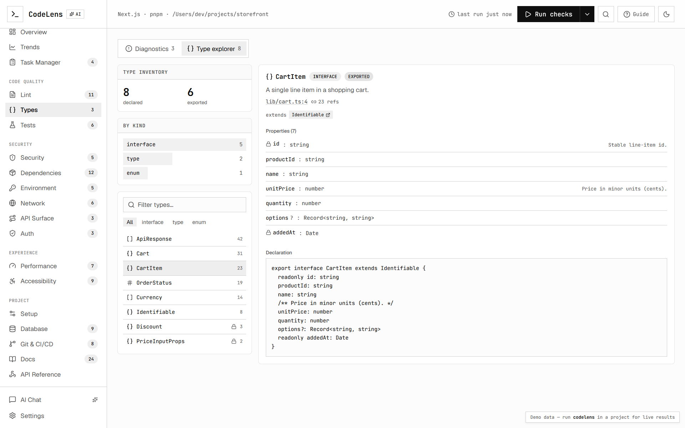 | 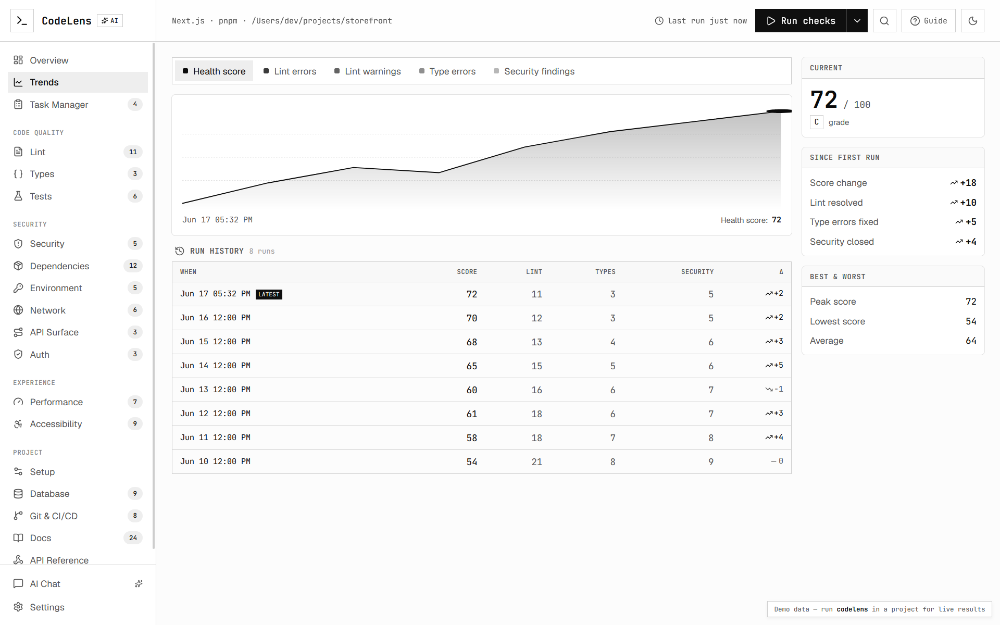 |
| 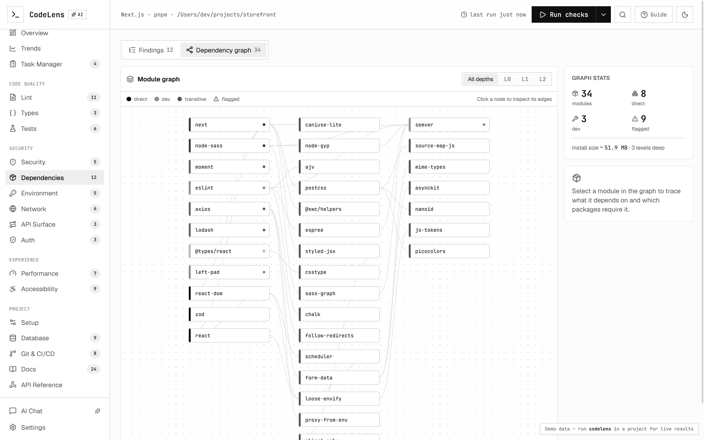 | 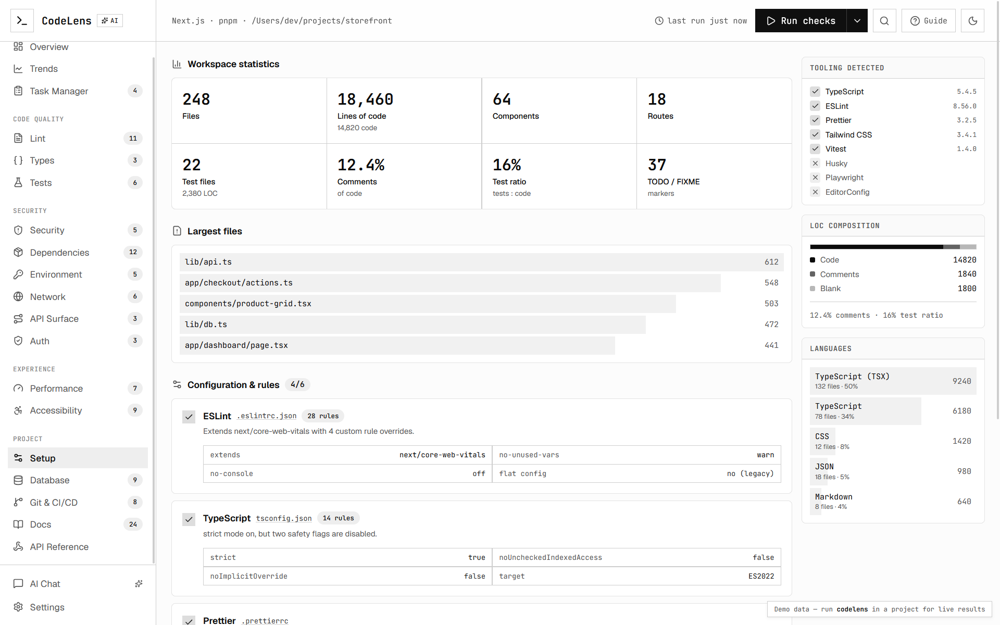 |
| 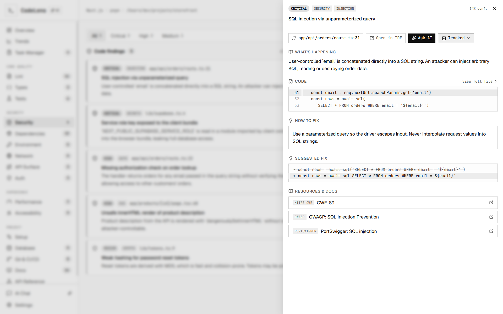 | 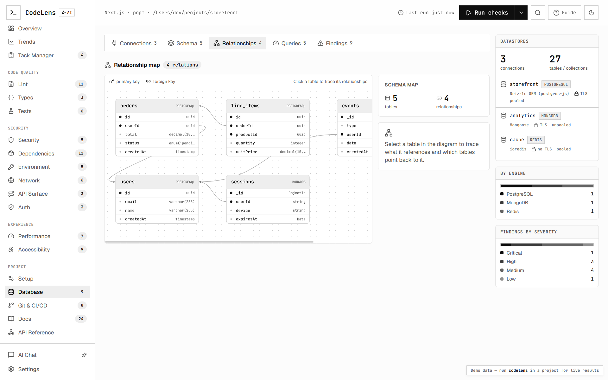 |
| 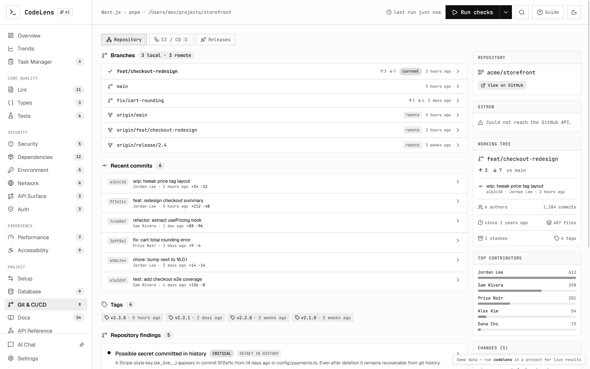 | 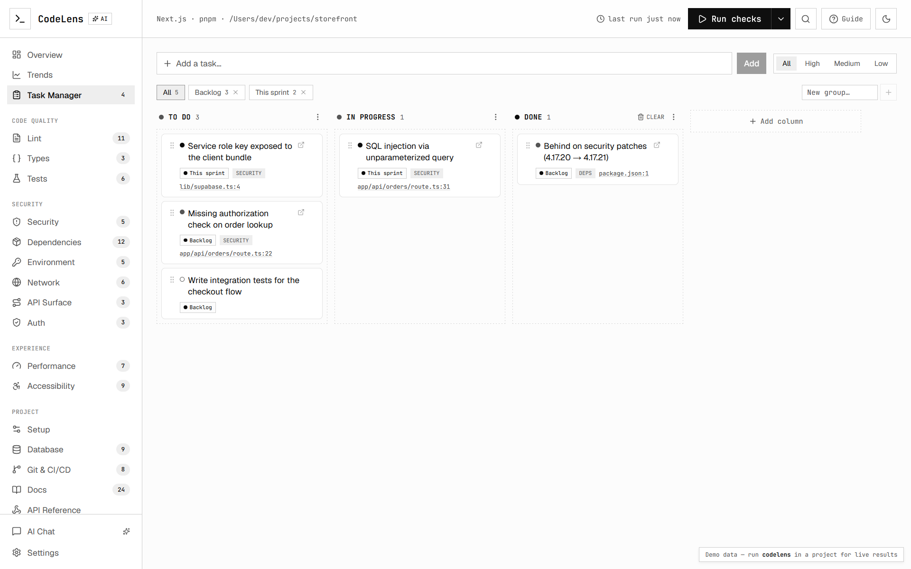 |
| 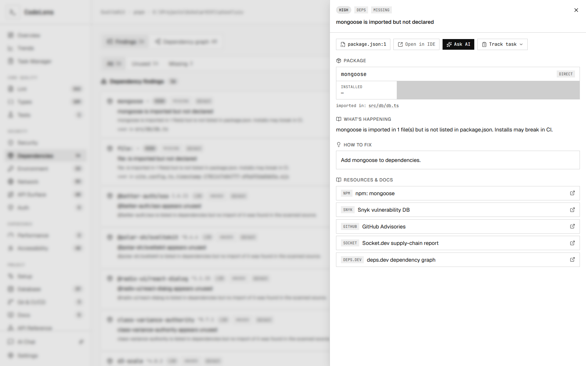 | 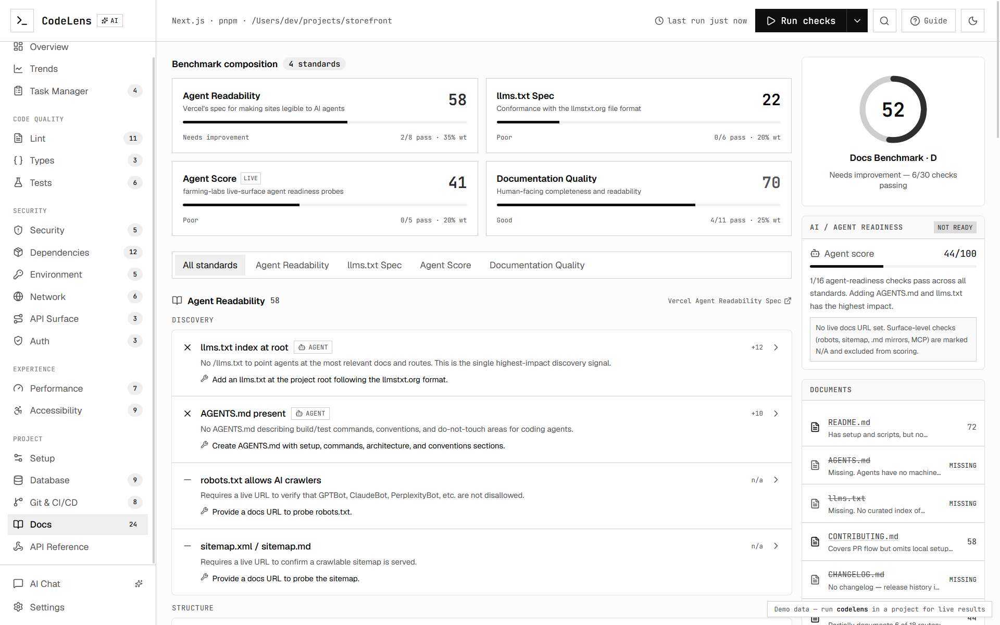 |

## CLI Usage

```bash
projectlens                 # run checks + open the dashboard
projectlens --no-ai         # skip the AI security pass (lint + types only)
projectlens --ci            # run once, print summary, exit non-zero on issues
projectlens --json          # print the full report as JSON and exit
projectlens --min-score 80  # in --ci mode, fail if health score < 80
projectlens --dir /path     # analyze a specific directory
```

## AI Security Audit

The AI pass needs a model key. Projectlens uses the Vercel AI Gateway:

```bash
export AI_GATEWAY_API_KEY=...   # recommended
# or
export OPENAI_API_KEY=...
```

Without a key, lint + type-check + dependency advisories still run; only the AI code review and prioritization are skipped.

## License

MIT
